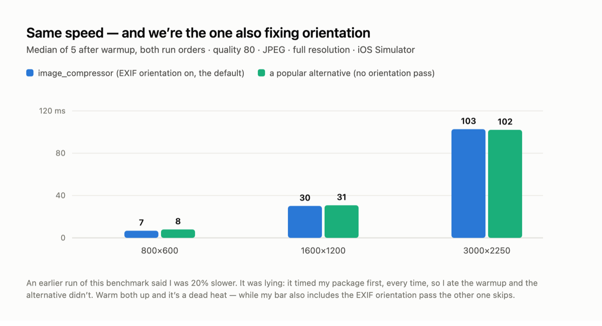
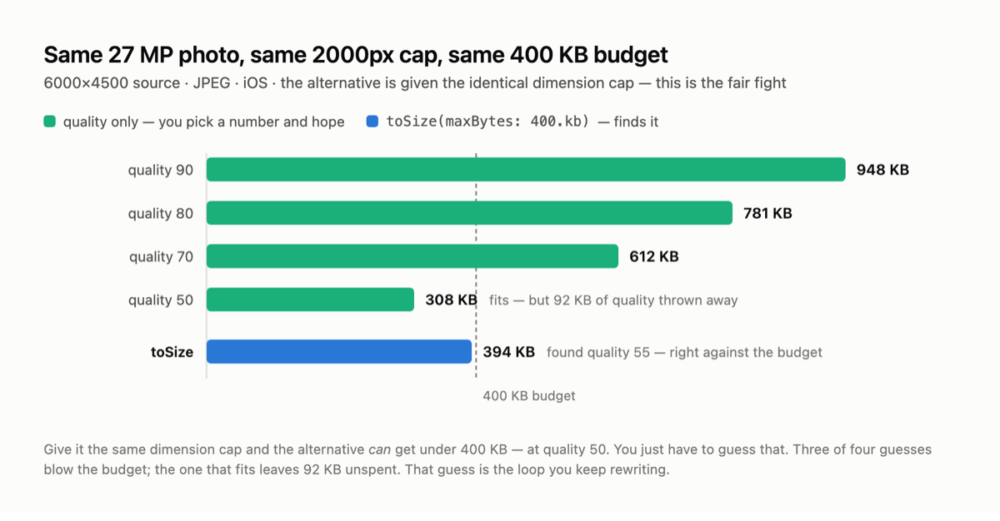

# Benchmarks

Head-to-head against [`flutter_image_compress`](https://pub.dev/packages/flutter_image_compress)
(the popular incumbent) on identical inputs, measured by the integration suite
in [`example/integration_test/benchmark_test.dart`](example/integration_test/benchmark_test.dart).

`quality: 80`, JPEG, full resolution (no downscale) unless noted. **Numbers are
device-dependent — the relative comparison on one device is the point, not the
absolute milliseconds.**

### Methodology (the first version of this file was wrong)

The original benchmark reported us ~20% slower. It was measuring its own bias:
it timed **our** package first for every size, so we paid the JIT / native-load /
allocator warmup and the incumbent — running second — did not. Corrected:

* **warm up** both sides before timing (2 untimed runs each, plus a global warmup),
* run **both orders** (ours→theirs and theirs→ours) and report both, so any
  residual ordering bias is visible instead of hidden,
* compare like for like: the incumbent does no EXIF orientation, so the
  apples-to-apples row is ours with `autoOrient: false`. The default (`true`) row
  is reported too — that's what you actually get.

## iOS Simulator (iPhone 17 Pro Max) — median of 5, warmed



Two numbers per cell = the two run orders.

| Source | ours (`autoOrient: false`) | ours (default, orientation **on**) | flutter_image_compress |
|--------|---------------------------|-----------------------------------|------------------------|
| 800×600     | 9 / 7 ms   | **7 ms**   | 8 / 8 ms |
| 1600×1200   | 31 / 30 ms | **30 ms**  | 31 / 31 ms |
| 3000×2250   | 101 / 101 ms | **103 ms** | 102 / 102 ms |

**It's a dead heat** — and our number includes the orientation pass the other
side skips. The earlier "we're 20% slower" claim was an artifact, not a fact.

## Android Emulator (Pixel 9a) — too noisy to conclude

| Source | ours | flutter_image_compress |
|--------|------|------------------------|
| 800×600     | 11 / 6 ms    | 7 / 7 ms |
| 1600×1200   | 23 / 61 ms   | 38 / 62 ms |
| 3000×2250   | 233 / 241 ms | 256 / 222 ms |

The two run orders disagree by 2–3× on the same work (23 vs 61 ms), so this
emulator can't measure at this resolution. Directionally comparable; **no claim
is made from these numbers.** Needs a physical device.

## Large image — 6000×4500 (27 MP), the FAIR comparison

An earlier version of this file compared our 2000px-capped output against the
incumbent forced to **full resolution**. That was a rigged fight — it has a
dimension cap too, we just hadn't given it one. Corrected: **same 2000px cap for
both**, 400 KB budget, iOS.



| Setting | Output | Verdict |
|---|---|---|
| quality 90 | 948 KB | over budget |
| quality 80 | 781 KB | over budget |
| quality 70 | 612 KB | over budget |
| quality 50 | 308 KB | fits — but 92 KB of quality unspent |
| **`toSize(maxBytes: 400.kb)`** | **394 KB** (found quality 55) | fits, uses the budget |

Given the same cap the incumbent *can* land under 400 KB — at quality 50, if you
guess it. Three of the four obvious guesses blow the budget; the one that fits
throws away 92 KB. That guess is the loop `toSize` removes.

## The cost of `autoOrient`

We assumed the EXIF-orientation pass was expensive, then measured it instead of
asserting it (3000×2250, median of 5, iOS):

| | Median |
|---|---|
| `autoOrient: true` (default) | 105 ms |
| `autoOrient: false` | 101 ms |
| **delta** | **~4 ms** |

Nearly free — inside the run-to-run noise at this size. Correct orientation is
not costing you anything measurable.

## Honest reading

- **Raw speed is a dead heat on iOS** (7/30/103 ms vs 8/31/102 ms), with our
  number including the orientation pass the incumbent skips. We are not slower;
  the earlier claim that we were came from an unwarmed, single-order benchmark.
- **Output size is comparable** — identical on iOS (same engine), ~15% smaller on
  Android.
- **The measured advantage is target-size.** Not "we make smaller files" — given
  the same dimension cap, a quality number can get there too. The advantage is
  that you don't have to *find* the number: `toSize` searches and lands against
  the budget.
- **OOM was NOT reproduced here.** The incumbent's documented large-image OOM
  crashes are real (its issue tracker) but are specific to low-RAM devices; these
  test devices have too much RAM to trigger them, so we make no "we don't OOM,
  they do" claim — only that decode-time downsampling keeps peak memory bounded
  by construction.

Run them yourself:
```
flutter test integration_test/benchmark_test.dart -d <device>   # timing
flutter test integration_test/fairness_test.dart  -d <device>   # fair 27MP + autoOrient cost
```
