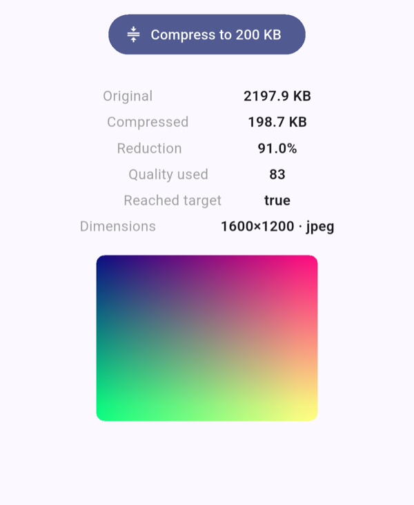

# 🗜️ image_compressor

Compress images in Flutter — **to a target file size**, in one call.

[](https://pub.dev/packages/image_compressor)
[](LICENSE)

[](https://github.com/sponsors/Ozdemiroguz)

```dart
final image = await ImageCompressor.toSize(
  ImageSource.xfile(pickedImage), // straight from image_picker
  maxBytes: 500.kb,                // "get it under 500 KB"
);
await image.saveTo('/path/out.jpg');
```

No hand-rolled quality loop, no guessing a magic quality number. Give it a byte
ceiling and it finds the highest quality that fits — natively, decoding the
image only once.

<p align="center">
  
</p>

Android · iOS · Web. MIT licensed.

---

## 🤔 Why this exists

Every other Flutter compressor makes you pick a `quality: 0–100` and hope the
result is small enough. But what you actually need is almost always *"make this
fit under X KB"* — for an upload limit, an avatar, an attachment. So everyone
writes the same quality-guessing loop by hand.

`image_compressor` makes that the headline feature (`toSize`), and does the
search in native code so it stays fast on large photos. It also fixes the papercuts
that plague the popular options:

- **Target file size** — the thing no other package does.
- **Zero-config web** — real in-browser encoding via `OffscreenCanvas`, no
  `pica` script tag, no extra setup.
- **No OOM on big images** — downsamples during decode instead of loading a
  full bitmap and then shrinking it.
- **Orientation just works** — EXIF rotation is baked into the pixels by default.
- **Never returns `null`** — hard failures throw a typed `CompressError`.

### How it compares

| | **image_compressor** | Most other packages |
|---|:---:|:---:|
| Compress to a **target file size** | ✅ | ❌ |
| Zero-config web | ✅ | ❌ / needs setup |
| Automatic EXIF orientation | ✅ | varies |
| Large images without OOM (decode-time downsample) | ✅ | ❌ |
| Batch + progress + cancel | ✅ | rare |
| Typed errors, never `null` | ✅ | varies |
| One API, not several overlapping methods | ✅ | varies |

Speed is a dead heat with the popular packages (103 ms vs 102 ms on a 6.75 MP
photo — and ours includes the orientation pass theirs skips). What it adds is
*control*. Give a 27 MP photo a 2000px cap and a 400 KB budget: quality 90/80/70
all blow the budget, quality 50 fits but throws away 92 KB — and you'd have to
guess which. `toSize` searches, finds quality 55, lands at **394 KB**. Numbers
and method in [BENCHMARK.md](BENCHMARK.md).

## 📦 Install

```yaml
dependencies:
  image_compressor: ^0.1.0
```

```dart
import 'package:image_compressor/image_compressor.dart';
```

## 🎯 Compress to a target size

```dart
final image = await ImageCompressor.toSize(
  ImageSource.file('/path/photo.jpg'),
  maxBytes: 500.kb,
);

print('${image.originalBytes} → ${image.compressedBytes} bytes');
print('quality ${image.usedQuality}, reachedTarget ${image.reachedTarget}');

final bytes = image.bytes;             // Uint8List, ready to upload
await image.saveTo('/path/out.jpg');   // or write it to disk (native only)
```

If even the lowest quality can't reach `maxBytes`, you still get the smallest
achievable result back with `reachedTarget == false` — never an exception, never
`null`.

> `maxBytes` is a plain byte count. Importing the package adds `.kb` / `.mb`
> helpers so you can write `500.kb` or `2.mb` instead of `500 * 1024`.

`toSize` produces an image **in the requested `format`, under `maxBytes`** — it
targets a size, it does not guarantee the output is smaller than the input. For
a normal camera photo it always shrinks. The one exception is a source that is
already tiny in a more efficient format (e.g. a small PNG re-encoded to JPEG):
the format conversion can make it larger while still fitting under the ceiling.
Compare `compressedBytes` to `originalBytes` if you want to keep the smaller of
the two.

## 🎚️ Fixed quality

```dart
final image = await ImageCompressor.toQuality(
  ImageSource.bytes(sourceBytes),
  quality: 80,
  maxWidth: 1920,   // optional: also cap dimensions (aspect preserved)
);
```

## 🗂️ Any input source

```dart
ImageSource.bytes(uint8List)   // already in memory
ImageSource.file('/path.jpg')  // a file on disk (not on web)
ImageSource.asset('a/b.png')   // a bundled asset
ImageSource.xfile(xfile)       // an XFile from image_picker / file_picker
```

## 📚 Batch, with progress and cancellation

```dart
final token = CancelToken();

final results = await ImageCompressor.toSizeAll(
  pickedFiles.map(ImageSource.xfile).toList(),
  maxBytes: 300.kb,
  concurrency: 3,                    // how many at once (bounds memory)
  onProgress: (done, total) => setState(() => _p = done / total),
  cancelToken: token,               // token.cancel() stops launching new work
);
```

## 🖼️ Formats

Requesting an unsupported format throws `UnsupportedFormatError` — never silent
wrong output.

| Format | Android | iOS | Web |
|--------|:-------:|:---:|:---:|
| JPEG   |   ✓     |  ✓  |  ✓  |
| PNG    |   ✓     |  ✓  |  ✓  |
| WebP   |   ✓     |  ✗  |  ✓  |
| HEIC   |   ✗     |  ✓  |  ✗  |

JPEG/PNG are safe everywhere. WebP is Android + web (iOS ImageIO has no WebP
encoder). HEIC is iOS only.

```dart
await ImageCompressor.toSize(input, maxBytes: 500.kb,
    format: ImageFormat.webp);
```

## 📤 What you get back

`CompressedImage`:

| Field | Meaning |
|-------|---------|
| `bytes` | the compressed image (`Uint8List`) |
| `width` / `height` | decoded output dimensions |
| `originalBytes` / `compressedBytes` | before / after size |
| `ratio` | `compressedBytes / originalBytes` |
| `usedQuality` | the quality the encoder landed on |
| `reachedTarget` | `toSize` only — did it fit under `maxBytes`? |
| `saveTo(path)` | write to disk, returns the path (native only) |

## ⚖️ Platform notes

- **Native-heavy by design.** The target-size search runs in Kotlin / Swift /
  the browser, so an image is decoded once, not once per quality probe.
- **Web** needs `OffscreenCanvas.convertToBlob` (Safari 16.4+ / evergreen
  engines).
- **`autoOrient`** defaults to `true` (EXIF rotation baked into pixels). On iOS,
  `autoOrient: false` also drops the orientation tag.

## 🚫 Errors

Everything throws a subtype of the sealed `CompressError`:

```dart
try {
  final img = await ImageCompressor.toSize(input, maxBytes: 500.kb);
} on UnsupportedFormatError { /* format not encodable on this platform */ }
on SourceNotFoundError    { /* missing file / bad asset / file on web */ }
on DecodeError            { /* not a decodable image */ }
on CancelledError         { /* cancelled via CancelToken */ }
```

## 💛 Support

This package is free and MIT-licensed, maintained solo in my spare time. If it
saved you time, [a coffee via GitHub Sponsors](https://github.com/sponsors/Ozdemiroguz)
helps keep it maintained and new packages coming.

## 👤 Author

Oğuzhan Özdemir · [github.com/Ozdemiroguz](https://github.com/Ozdemiroguz)

## 📄 License

MIT — see [LICENSE](LICENSE).
